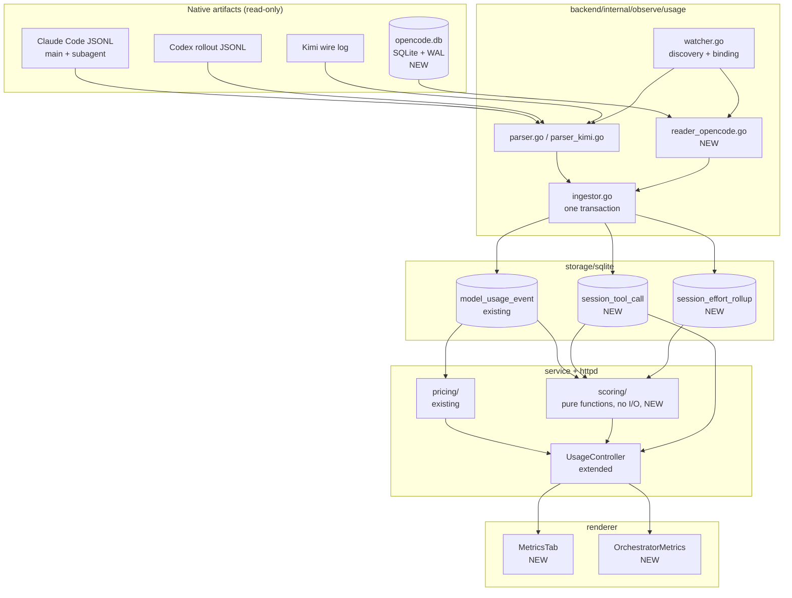

# Session Metrics and Efficiency Scoring

Date: 2026-09-11
Status: design approved, not implemented

## Problem

AO runs many agent sessions across several projects and already knows more
about each one than any monitoring tool could: the worktree, the branch, the
PR, the CI result, the review round-trips, the merge. It also already measures
token consumption and estimates cost.

None of that reaches the user.

Three concrete failures motivate this work:

1. The session inspector's usage block is gated behind `developerMode`
   (`frontend/src/renderer/components/SessionInspector.tsx:279`), so the
   tokens and cost AO computes are rendered to nobody — even though the same
   estimates are trusted enough to show on board cards.
2. Orchestrator sessions have no inspector rail at all
   (`frontend/src/renderer/components/SessionView.tsx:1081`). The
   longest-lived, most expensive session in a project is the least observable
   one.
3. AO records no durable tool-call facts. When a worker is "busy" but not
   progressing, there is nothing to inspect.

Separately, `ai-code-show-and-tell` scores finished sessions for AI-usage
efficiency by parsing transcripts after the fact, using a model for most of its
rubric. Those judgments are more useful while work is in flight — and for the
efficiency half of that rubric, AO holds strictly better evidence than a
transcript does, well enough to compute the scores outright instead of asking a
model to infer them.

## Goals

- Surface the token, cost, context, effort and tool-call facts for a session
  in a dedicated **Metrics** tab in the inspector rail, with no developer-mode
  gate.
- Give orchestrator sessions a Metrics-only rail carrying a project-scoped
  roll-up: worker spend, orchestrator-versus-worker ratio, cost per merged PR.
- Ingest opencode as a first-class usage source, at parity with Claude Code
  and Codex.
- Record tool-call telemetry as durable, queryable facts for every harness
  whose source exposes them.
- Compute efficiency scores entirely from structured data, at **zero** LLM
  cost. No model is ever called by this feature.
- Never fabricate. Absent evidence renders as unavailable, never as zero.

## Non-goals

- **Hook installation.** AO will not write to `~/.claude/settings.json`,
  `~/.codex/hooks.json`, or install an opencode plugin. Ingestion stays on the
  transcript/database pipeline AO already owns. Hooks remain a possible future
  enrichment for live tool latency, behind a setting, and are out of scope
  here.
- **Manual kanban placement.** The board column is a pure derivation
  (`backend/internal/domain/kanban.go`). Letting a user drag a worker to
  another column requires durable override state and a policy for when a
  derived fact later contradicts the human's placement. That is a real gap and
  a separate design.
- **Top-level Usage / History pages.** The CCAM gap analysis proposes new
  global navigation. This spec stays in the inspector rail. Cross-project
  analytics can reuse the same read models later.
- **Session parentage.** Not needed; see Decisions.
- **Retroactive scoring of historical sessions** as a batch job.
- **LLM-based qualitative scoring.** The four factors from
  `ai-code-show-and-tell` that require reading prose — prompt clarity, initial
  context completeness, business impact, cross-session learning — and its
  narrative and traceability outputs are out of scope. This feature calls no
  model. Those factors can be added later as an explicit, cached, user-invoked
  action; nothing in this design forecloses that, because the scoring module
  is already structured as pure functions over facts and would simply gain a
  second, optional set of inputs.

## Decisions

### Transcripts, not hooks

CCAM installs shell hooks per provider and reconstructs state from loosely
typed JSON. AO already tails native artifacts with a cursored
watcher/parser/ingestor it controls (`backend/internal/observe/usage/`).

Extending that pipeline costs zero LLM tokens (it is compiled Go over JSON),
spawns no subprocess per tool call, mutates no user configuration, survives an
agent CLI reinstall, and works on sessions that already finished. It is
strictly cheaper and more robust than the hook model. The tradeoff accepted is
freshness: telemetry lands on a watcher tick rather than instantly.

### Project scope, not session parentage

AO has no `parent_session_id` and does not need one. It enforces **one active
orchestrator per project**:

- `service/session/service.go:478` — `EnsureOrchestrator` returns the existing
  active orchestrator rather than spawning a second.
- `session_manager/manager.go:4102` — `activeOrchestratorSessionID` takes the
  first non-terminated orchestrator in the project.
- Replacement retires the incumbent (`orchestratorRetireNotice`).

So `project_id` already partitions orchestrators correctly, and "multiple
orchestrators" means one per project across several projects.

One consequence must be stated in the UI rather than hidden: restarting an
orchestrator retires the old session and creates a new one, so a long-lived
project accumulates **generations**. Project-lifetime totals span all of them.
The orchestrator Metrics tab therefore shows two clearly separated figures —
*this orchestrator* and *project all-time across N generations*.

### Zero LLM, entirely

Scoring is restricted to the five rubric factors that are deterministic
functions of structured facts. The four qualitative factors are dropped (see
Non-goals). Nothing in this feature calls a model, so the Metrics tab costs
nothing to open, works offline, needs no API key, and returns the same score
for the same facts every time.

A consequence worth stating: scores are cheap enough to compute on read from
the effort rollup and usage events, so they need no table and no cache. This
also means a rubric threshold change takes effect immediately on every
session, with no stored scores to migrate or reinterpret.

## Architecture



### Ingestion sequence

```mermaid
sequenceDiagram
    participant W as watcher
    participant R as reader_opencode
    participant I as ingestor
    participant DB as AO sqlite
    participant API as UsageController
    participant UI as MetricsTab

    W->>W: session worktree path known
    W->>R: bind by session.directory == worktree path
    R->>R: open opencode.db mode=ro, WAL
    R->>R: read rows after cursor (session_id, seq)
    R-->>I: token vectors, tool calls, compactions, churn
    I->>DB: one transaction:<br/>usage events + tool calls + effort + cursor
    Note over I,DB: cursor advances only on commit;<br/>a crash re-reads, never double-counts
    UI->>API: GET session metrics
    API->>DB: read models
    API->>API: score (pure functions, computed on read)
    API-->>UI: metrics + scores + coverage
```

## Component 1: opencode usage source

opencode migrated from per-session JSONL files to a single SQLite database at
`~/.local/share/opencode/opencode.db` (the `migration` table records the
cutover; only `storage/session_diff/` remains as JSON). The
`Claude-Code-Agent-Monitor` opencode integration spec was written against the
old layout and its central premise — that opencode parity means porting a
~3,500-line hook state machine — no longer holds. The database already
contains the aggregates other providers make you derive.

Verified against live data:

| Signal | Location |
|---|---|
| Token vector per session | `session.tokens_input`, `_output`, `_reasoning`, `_cache_read`, `_cache_write` |
| Cost per session | `session.cost` (REAL) |
| Worktree binding | `session.directory` |
| AO agent identity | `session.agent` (AO names it `ao-<session>`) |
| Subagent hierarchy | `session.parent_id` |
| Model | `session.model` (JSON: `{id, providerID, variant}`) |
| Compaction | `session.time_compacting`; `part` rows `type='compaction'` with `{auto, overflow}` |
| Code churn | `session.summary_files`, `_additions`, `_deletions` |
| Tool calls | `part` rows `type='tool'`: `callID`, `tool`, `state.status`, `state.time.{start,end}` (ms), `state.metadata` |
| Per-step tokens | `part` rows `type='step-finish'`: `{total, input, output, reasoning, cache:{read,write}}` |
| Ordering cursor | `session_message.seq` |

**Binding.** `session.directory` holds AO's own worktree path (observed:
`/home/arios/.ao/dev/data/worktrees/scratch/workers/scratch-4`). Binding is an
exact path match against `SessionMetadata.WorkspacePath`, not a heuristic.
`session.agent` (`ao-scratch-4`) is a corroborating signal, used to
disambiguate when two opencode sessions share a directory; it is never the
primary key, since a user may rename an agent.

**Implementation.** A new `UsageSourceKind` value `opencode_db`, and a
`reader_opencode.go` sibling to `parser.go`. It opens the database read-only
(`mode=ro`, WAL-aware, busy timeout) and never writes. Its cursor is
`(session_id, last_seq)` persisted in `ParserStateJSON` rather than a byte
offset; `SourceCursorState.ByteOffset` stays zero for this kind. Output feeds
the existing ingestor and produces the same `ModelUsageEvent` rows as every
other source.

**Measurement kind.** opencode reports its own token counters and cost, so
events are `UsageMeasurementNativeReported`. `session.cost` is opencode's
number; AO also prices the token vector through its own catalog and prefers
its own estimate for cross-harness comparability, retaining opencode's figure
for reconciliation and diagnostics.

**Zero cost is not missing cost.** Local-model sessions legitimately report
`cost = 0.0` (observed with `ai-local-models-cpu/gemma4`). This is expressed
through the existing `EstimatedCostCoverage`: a known-free session shows
`$0.00`, an unmeasured one shows unavailable. The two must never render alike.

**Robustness.** A locked or mid-migration database, an unreadable path, or an
unknown schema version increments `FailureCount` and sets a `LastErrorCode`
using the existing `UsageError*` vocabulary; it never fails a session. Schema
drift is detected by checking for the required columns on open and degrades to
whichever signals are present.

## Component 2: tool-call telemetry

`ModelUsageEvent` has nowhere to record "Bash ran 4.2s and exited 0". One new
append-only table, written inside the ingestor's existing transaction:

`session_tool_call` — session id, source kind, provider call id, tool name,
whether the tool is an MCP tool and which server, a bounded input summary,
outcome (`completed` / `failed` / `denied` / `unknown`), start and end
timestamps (both nullable), duration (nullable, derived only when both
timestamps are known), and a nullable exit code for command tools.

Rules:

- Nullable means unknown, exactly as `UsageTokenMetrics` already establishes.
  A tool call with no timing is recorded with no timing, not with zero.
- Input summaries are bounded and redacted on the same path AO already uses
  for activity text. Tool *output* is never stored; it is unbounded and often
  sensitive.
- `(session_id, source_kind, provider_call_id)` is unique, so re-reading a
  source after a crash is idempotent.

Per-harness coverage:

| Source | Tool name | Outcome | Timing | Exit code |
|---|---|---|---|---|
| opencode | yes | yes | exact, from `state.time` | when the tool reports it |
| Claude Code | yes | yes | partial | no |
| Codex | yes | yes | partial | partial |
| Everything else | none | none | none | none |

`session_effort_rollup` stores the derived per-session counters the tab and the
scorer both need — duration, active versus idle time, tool-call count, files
read, files changed, lines added and removed, commands run, tests run,
compaction count — recomputed on ingest so reads stay cheap.

Two of those counters need their definitions pinned, because they are
derivations rather than observations:

- **Active versus idle time.** Duration is wall-clock from first to last
  observed event. *Active* time is the union of intervals covered by observed
  activity — tool-call spans where timing exists, and otherwise the interval
  between consecutive events when that gap is under a threshold (default 120
  seconds, in the same versioned table as the scoring thresholds). *Idle* is
  duration minus active. Where a source provides no timing at all, both are
  unavailable rather than equal to duration, since a session with no timing is
  not a session that was busy the whole time.
- **Tests run.** Counted from command-tool invocations whose command matches a
  configured set of test-runner patterns (`pytest`, `go test`, `npm test`,
  `vitest`, `jest`, and so on), maintained in one list in the ingestor. This
  is a heuristic and is labelled as such in the UI; a project with a custom
  test command will undercount. It is never used as a governance *gate* — only
  as a displayed count and a scoring input.

## Component 3: Metrics tab (worker sessions)

The inspector rail becomes `Summary · Metrics · Reviews · Browser · Files`.
Summary keeps its delivery role; Metrics owns telemetry.

The existing usage block **moves** into Metrics and loses its `developerMode`
gate. `developerMode` then controls only genuine diagnostics — source state,
cursor position, ingestion error codes — which is that flag's actual purpose.

The rail is roughly 320px, so Metrics is a vertical stack of blocks, not a
dashboard. Each block renders only when it has data.

1. **Cost & tokens.** Estimated cost, then the token vector (input, cached,
   uncached, output), with per-harness and per-model rows. This is today's
   `UsageCostTelemetry` component, unchanged and ungated.
2. **Context health.** The existing `ContextMeter`, plus compaction count and
   whether the most recent compaction was automatic or overflow-driven.
   Advisory only: context pressure is never rendered as a failure.
3. **Effort.** Duration, active versus idle time, tool calls, files read,
   files changed, lines changed, commands run, tests run.
4. **Tool mix.** A ranked list (`Read 62 · 43%`) **sorted by time spent, not
   call count**, because time spent is what answers "why is this worker busy
   but not progressing." Where timing is unavailable the list falls back to
   call count and says so. Each row expands to that tool's individual calls
   with duration and outcome.
5. **Efficiency.** The heuristic scores, each beside the raw numbers that
   produced it.
6. **Coverage.** One line stating what AO could and could not observe for this
   session, and why.

## Component 4: orchestrator Metrics rail

`SessionView.tsx:1081` currently reads:

```ts
// Orchestrators get the full workspace width; only workers need the inspector rail.
const hasInspector = Boolean(session && !isOrchestrator);
```

This becomes: orchestrators get a rail containing **only** the Metrics tab.
PRs, Reviews and Files genuinely do not apply to an orchestrator. The rail is
collapsible and collapsed by default, which preserves the original
full-workspace intent while ending the situation where the most expensive
session is the least observable.

Contents:

- **This orchestrator** — its own cost, tokens, duration, context health.
- **Workers, this project** — counts by outcome (active, merged, abandoned,
  failed), total worker spend, and the **orchestrator-to-worker spend ratio**,
  which is what answers whether an Opus orchestrator driving Sonnet workers is
  paying off.
- **Cost per merged PR** — project lifetime. AO is uniquely able to compute
  this because it owns the merge fact.
- **Worker list** — name, harness, model, duration, cost, outcome; sorted by
  cost descending so expensive sessions surface. Each row navigates to that
  session.
- **Generations** — "project all-time across N orchestrator generations", with
  this orchestrator's own window shown separately.

Backend: `UsageController` gains a project-scoped summary endpoint and a
session tool-call endpoint. The per-session read model is `SessionUsageSummary`
plus additive effort, tool-mix and score blocks — no breaking change to the
existing response shape.

## Component 5: scoring engine

`ai-code-show-and-tell`'s rubric was built for post-hoc forensics on a
transcript. AO owns delivery outcomes, so the factor *names* are kept — they
are what stakeholders already recognise — while each is computed from the
strongest evidence AO actually holds.

Only the five deterministic factors are in scope. The rubric's four
prose-reading factors are dropped, so the engine never calls a model.

The module is pure functions over fact structs, with no I/O, in
`backend/internal/service/scoring/`. Scores are computed on read; nothing is
persisted.

### The five factors

| Factor | Computed from |
|---|---|
| Token efficiency | cache-read ÷ total input, tokens per changed line, tokens per tool call |
| Exploratory overhead | read/search tool calls and tokens spent before the first file edit, as a share of session total |
| Human steering load | user turns after the initial prompt, interrupts, rejected approvals, follow-ups arriving after the agent first reported completion |
| Delivery efficiency | time and cost to first PR, rework loops (files edited three or more times), CI recovery cycles, review round-trips |
| Governance & auditability | structural, not judged: did the work land on a branch, in a PR, with review, and with CI green — four facts AO owns outright |

Governance is the clearest case of re-grounding. The original tool had to ask a
model to *opine* on auditability. AO can simply check.

CI green is the evidence used for "was this verified", not the heuristic
tests-run count defined above. The count is displayed as effort and may feed
delivery efficiency, but governance rests only on facts AO owns directly, so
a project with a custom test command is never scored down for it.

Each factor yields a 0-100 sub-score **and the raw numbers that produced it**,
both always rendered. A bare "Token Efficiency: 62" is unfalsifiable, and a
score the user cannot audit is worse than no score.

Thresholds and weights live in one table inside the module, carrying a rubric
version that is reported alongside the scores. Because nothing is stored,
changing a threshold takes effect everywhere at once and there are no
historical scores to migrate — but the version is still surfaced so a user
comparing two screenshots taken weeks apart can tell whether the rubric moved
underneath them.

### Refusal to fabricate

A session with no certified usage source gets **no scores** — not zeros, not a
"low" rating. Partial coverage scores only the factors its evidence supports
and names the ones it skipped. This is the single rule that makes the numbers
worth trusting, and it is enforced in the scoring module rather than in the UI,
so no future caller can bypass it.

## Data flow: worker to orchestrator roll-up

```mermaid
sequenceDiagram
    participant U as User
    participant UI as Orchestrator Metrics
    participant API as UsageController
    participant S as scoring
    participant DB as AO sqlite

    U->>UI: expand orchestrator rail
    UI->>API: GET /projects/{id}/usage-summary
    API->>DB: usage events grouped by session kind
    API->>DB: session outcomes (PR merged / abandoned / failed)
    API->>DB: orchestrator generations for project
    API->>S: derive ratio, cost per merged PR
    S-->>API: figures + coverage
    API-->>UI: this orchestrator | workers | project all-time
    Note over UI: generations stated explicitly;<br/>unmeasured sessions counted<br/>as unavailable, not as zero
```

## Error handling

- **Unreadable or locked source** — increment `FailureCount`, set
  `LastErrorCode`, schedule retry via the existing `NextRetryAt`. Never fail
  the session.
- **Schema drift in opencode.db** — detect missing columns on open, degrade to
  available signals, record a diagnostic error code.
- **Partial coverage** — every read model carries an explicit coverage field.
  The UI renders coverage, never infers completeness from non-null values.
- **Crash mid-ingest** — cursor advances only on commit; the unique constraint
  on tool calls makes re-reading idempotent.
- **No source for harness** — Metrics tab renders a single honest line naming
  the harness and stating telemetry is unavailable for it.

## Testing

- **Scoring** — table-driven unit tests over fixture fact structs: a clean
  one-shot session, a heavily-steered session, an abandoned session, a
  zero-cost local-model session, an unsupported-harness session, and a
  partial-coverage session. Assert that unsupported and partial cases produce
  absent factors rather than zeros.
- **opencode reader** — tests against a small committed fixture database
  covering tool parts with and without timing, `step-finish` token vectors,
  compaction parts, a local-model zero-cost session, and a schema missing
  later-added columns.
- **Ingestor** — extend the existing integration tests with an `opencode_db`
  source, including a crash-and-resume case asserting no double counting.
- **UI** — component tests for each Metrics block asserting the three states
  (unavailable, partial, complete) render distinctly, and that the usage block
  renders with `developerMode` off.
- No mocking of the usage pipeline; it already has integration coverage to
  extend.

## Implementation phases

1. **Ungate and relocate.** Add the Metrics tab, move the existing usage block
   into it, remove the `developerMode` gate. Ships visible value on day one
   with no new ingestion.
2. **opencode source.** `opencode_db` reader, binding by worktree path, token
   and cost events through the existing ingestor.
3. **Tool telemetry.** `session_tool_call` and `session_effort_rollup`, the
   effort and tool-mix blocks, opencode timing first, then Claude and Codex
   partial coverage.
4. **Scoring.** The scoring module, the five factors, the efficiency block
   with raw numbers beside each score.
5. **Orchestrator rail.** Project-scoped roll-up, worker list, cost per merged
   PR, generations.

All five phases are independently shippable and each leaves the product in a
coherent state.

## Open questions

None blocking. Two to revisit after phase 3:

- Whether Claude Code and Codex transcripts carry enough timing to make the
  time-sorted tool mix useful for them, or whether those harnesses should
  default to count-sorted. Phase 3 answers this with real data.
- Whether hooks are worth adding as an optional enrichment purely for live
  tool latency, once the transcript-derived numbers are visible and their
  freshness can be judged in practice.
