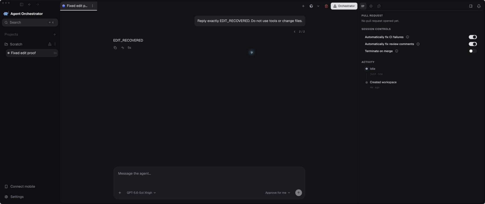

# Review corrections — 11 September 2026

The six-PR scope and dependency order remain #5105 → #5106 → #5107 → #5109 → #5110 → #5111. This follow-up fixes review findings and checks the failure boundaries that the earlier review missed.

## Corrected behavior

| PR | Failure before correction | Behavior after correction |
| --- | --- | --- |
| #5109 | Cancel, Escape, opening another queued edit, or deleting the queued row could erase the only receipt after a lost save response. | The unresolved receipt and exact payload survive those exits and reload; retry uses the same delivery ID. |
| #5109 | A conclusive stale-revision or already-dispatched rejection left the editor permanently locked. | The editor retains its content and releases its recovery ID after a definitive rejection. A reused-key conflict or transport ambiguity preserves the ID. API error codes reach the UI intact. |
| #5109 | The composer overwrote the queue dock’s recovery disabled flag. | Queue controls stay disabled while receipt recovery is pending. |
| #5110 | A missing edit anchor returned 404 initially, then 400 on receipt replay. | Initial request, retry, and retry after restart all return 404. |
| #5110 | A reservation committed just before cancellation was permanently uncertain despite no provider work. | A durable dispatch boundary allows the same request to resume only when provider work has not begun. Old receipts default conservatively to “may have begun.” |
| #5110 | A provider completed the replacement turn, but the receipt completion write was lost. | Recovery repairs the receipt from the matching completed replacement turn and branch, without another provider send. Running/failed/ambiguous turns are not used as proof. |
| #5110 | A shutdown acknowledgement arrived before the old persistent host released ownership. The fresh replacement reattached the old provider, failed, and surfaced “delivery uncertain.” | Replacement waits for the old descriptor and lock to disappear before launching the new provider. |
| #5110 | A failed host shutdown closed the event stream, and recovery mistook the stopped projection for confirmed termination. It rotated the surviving provider’s browser credential and broke its authentication. | Recovery propagates the termination failure before rotating credentials or resuming a replacement. |
| #5111 | The opt-in regression gate only proved continued uncertainty. | It also asserts successful recovery after reservation loss and completion-write loss, with at-most-once provider delivery. |

## Real Electron and provider evidence

The app ran from the cumulative fixed stack at `633b27ca99af5b10517bf461dd9a447959b73504`, with the real daemon, Electron preload, persistent host and Codex provider. This preceded the additional definitive-queue-rejection and shutdown-failure guards; those later changes are covered separately by regression tests and the final reviewed heads in the validation record.

In an isolated scratch session, the first prompt asked for `ORIGINAL_READY`. Editing it to ask for `EDIT_RECOVERED` returned HTTP 202, created branch 2 of 2, and produced the expected real provider response.

The controller was then stopped with `ao session exit-agent scratch-1` and resumed with `ao session resume-agent scratch-1`. Replaying the original source-turn edit with its identical client message ID returned HTTP 202 and the same replacement turn. A read-only SQLite query found exactly one matching user message. The edited branch and response remained visible in Electron:

[Recorded replay status, turn identifiers and message count](native-stop-resume-replay.json).

Before the host-ordering fix, the same native flow returned `409 CHAT_EDIT_UNCERTAIN`; the daemon diagnostic was `prepare edited conversation: persistent chat host already owns a provider conversation for a fresh session`. A detached-host regression with a deliberately slow provider exit reproduces the ownership race and passes after the fix.

The native stop/resume recording stops after successful completion. Cancellation exactly after reservation, loss of the completion write, and failed shutdown are deterministic real-service/SQLite or real-host regression scenarios, not claims that the native UI was manually crashed at those precise instruction boundaries. The JSON replay retains the receipt’s original state field; the screenshot and durable query establish that the replacement completed.

## Review and validation

[Complete local and current-head CI validation](validation.md) records exact tested heads, commands, outcomes and limits. [Spec review](spec-review.md) and [standards review](standards-review.md) keep the two review axes separate.

## Reproduction records

- Lost reservation: [before](reservation-red.log), [after](reservation-green.log).
- Lost completion write: [before](completion-red.log), [after](recovery-green.log).
- Missing-turn HTTP replay: [before](missing-turn-red.log), [after](missing-turn-green.log).
- Slow persistent-host exit: [before](host-red.log), [after](host-green.log).
- Definitive queued-edit refusal: [before](queue-refusal-red.log), [after](queue-refusal-green.log), [final renderer and hook tests](queue-final-focused.log), [Go queue/controller tests](queue-refusal-go-green.log).
- Failed host shutdown: [pinned failure](shutdown-pinned-red.log), [fixed behavior](shutdown-fixed-green.log), [real host remains reattachable after a failed shutdown](shutdown-host.log), [committed regression](host-shutdown-refusal-green.log).

Logs named “before” deliberately contain failing assertions. They are reproduction evidence, not validation passes.
